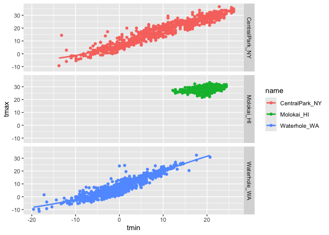

viz i
================

``` r
library(tidyverse)
```

    ## ── Attaching core tidyverse packages ──────────────────────── tidyverse 2.0.0 ──
    ## ✔ dplyr     1.1.4     ✔ readr     2.1.5
    ## ✔ forcats   1.0.0     ✔ stringr   1.5.1
    ## ✔ ggplot2   3.5.1     ✔ tibble    3.2.1
    ## ✔ lubridate 1.9.3     ✔ tidyr     1.3.1
    ## ✔ purrr     1.0.2     
    ## ── Conflicts ────────────────────────────────────────── tidyverse_conflicts() ──
    ## ✖ dplyr::filter() masks stats::filter()
    ## ✖ dplyr::lag()    masks stats::lag()
    ## ℹ Use the conflicted package (<http://conflicted.r-lib.org/>) to force all conflicts to become errors

``` r
weather_df=read_csv("./weather_df.csv", na=c("NA","","."))
```

    ## Rows: 2190 Columns: 6
    ## ── Column specification ────────────────────────────────────────────────────────
    ## Delimiter: ","
    ## chr  (2): name, id
    ## dbl  (3): prcp, tmax, tmin
    ## date (1): date
    ## 
    ## ℹ Use `spec()` to retrieve the full column specification for this data.
    ## ℹ Specify the column types or set `show_col_types = FALSE` to quiet this message.

``` r
weather_df
```

    ## # A tibble: 2,190 × 6
    ##    name           id          date        prcp  tmax  tmin
    ##    <chr>          <chr>       <date>     <dbl> <dbl> <dbl>
    ##  1 CentralPark_NY USW00094728 2021-01-01   157   4.4   0.6
    ##  2 CentralPark_NY USW00094728 2021-01-02    13  10.6   2.2
    ##  3 CentralPark_NY USW00094728 2021-01-03    56   3.3   1.1
    ##  4 CentralPark_NY USW00094728 2021-01-04     5   6.1   1.7
    ##  5 CentralPark_NY USW00094728 2021-01-05     0   5.6   2.2
    ##  6 CentralPark_NY USW00094728 2021-01-06     0   5     1.1
    ##  7 CentralPark_NY USW00094728 2021-01-07     0   5    -1  
    ##  8 CentralPark_NY USW00094728 2021-01-08     0   2.8  -2.7
    ##  9 CentralPark_NY USW00094728 2021-01-09     0   2.8  -4.3
    ## 10 CentralPark_NY USW00094728 2021-01-10     0   5    -1.6
    ## # ℹ 2,180 more rows

\##scatterplots create my first scatterplot ever

``` r
ggplot(weather_df,aes(x = tmin, y = tmax)) +
  geom_point()
```

    ## Warning: Removed 17 rows containing missing values or values outside the scale range
    ## (`geom_point()`).

<!-- -->

new approach , same plot

``` r
weather_df %>% 
  ggplot(aes(x= tmin, y =tmax)) +
  geom_point()
```

    ## Warning: Removed 17 rows containing missing values or values outside the scale range
    ## (`geom_point()`).

<!-- --> save ad edit a
plot object

``` r
weather_plot=
  weather_df %>% 
  ggplot(aes(x= tmin, y =tmax))

weather_plot+geom_point()
```

    ## Warning: Removed 17 rows containing missing values or values outside the scale range
    ## (`geom_point()`).

<!-- -->

## make an advance scatterplot

start with the same one and make it fancy

``` r
weather_df %>% 
  ggplot(aes(x= tmin, y =tmax, color=name)) +
  geom_point()+
  geom_smooth(se=FALSE)
```

    ## `geom_smooth()` using method = 'loess' and formula = 'y ~ x'

    ## Warning: Removed 17 rows containing non-finite outside the scale range
    ## (`stat_smooth()`).

    ## Warning: Removed 17 rows containing missing values or values outside the scale range
    ## (`geom_point()`).

<!-- -->

## what about the aes placement

``` r
weather_df %>% 
  ggplot(aes(x= tmin, y =tmax)) +
  geom_point(aes(color=name))+
  geom_smooth()
```

    ## `geom_smooth()` using method = 'gam' and formula = 'y ~ s(x, bs = "cs")'

    ## Warning: Removed 17 rows containing non-finite outside the scale range
    ## (`stat_smooth()`).

    ## Warning: Removed 17 rows containing missing values or values outside the scale range
    ## (`geom_point()`).

<!-- -->

noew facet

``` r
weather_df %>% 
  ggplot(aes(x= tmin, y =tmax, color=name)) +
  geom_point()+
  geom_smooth(se=FALSE, alpha= 0.5, size=0.2)+
  facet_grid(. ~ name)
```

    ## Warning: Using `size` aesthetic for lines was deprecated in ggplot2 3.4.0.
    ## ℹ Please use `linewidth` instead.
    ## This warning is displayed once every 8 hours.
    ## Call `lifecycle::last_lifecycle_warnings()` to see where this warning was
    ## generated.

    ## `geom_smooth()` using method = 'loess' and formula = 'y ~ x'

    ## Warning: Removed 17 rows containing non-finite outside the scale range
    ## (`stat_smooth()`).

    ## Warning: Removed 17 rows containing missing values or values outside the scale range
    ## (`geom_point()`).

<!-- -->

``` r
weather_df %>% 
  ggplot(aes(x= tmin, y =tmax, color=name)) +
  geom_point()+
  geom_smooth(se=FALSE)+
  facet_grid(name ~ .)
```

    ## `geom_smooth()` using method = 'loess' and formula = 'y ~ x'

    ## Warning: Removed 17 rows containing non-finite outside the scale range
    ## (`stat_smooth()`).

    ## Warning: Removed 17 rows containing missing values or values outside the scale range
    ## (`geom_point()`).

<!-- -->

let’s combine some elements and try a new plot

``` r
weather_df %>% 
  ggplot(aes(x=date, y =tmax, color=name)) +
  geom_point(alpha=0.5,aes(size=prcp))+
  geom_smooth(se=FALSE)+
  facet_grid(. ~ name)
```

    ## `geom_smooth()` using method = 'loess' and formula = 'y ~ x'

    ## Warning: Removed 17 rows containing non-finite outside the scale range
    ## (`stat_smooth()`).

    ## Warning: Removed 19 rows containing missing values or values outside the scale range
    ## (`geom_point()`).

<!-- -->

## small notes

how many geoms have to exsist? you can have whatever geoms you want. But
we need to include the points(better viewment)

``` r
weather_df %>% 
  ggplot(aes(x= tmin, y =tmax, color=name)) +
  geom_smooth(se= FALSE)
```

    ## `geom_smooth()` using method = 'loess' and formula = 'y ~ x'

    ## Warning: Removed 17 rows containing non-finite outside the scale range
    ## (`stat_smooth()`).

<!-- -->

you can use a neat geom

``` r
weather_df %>% 
  ggplot(aes(x= tmin, y =tmax)) +
  geom_hex()
```

    ## Warning: Removed 17 rows containing non-finite outside the scale range
    ## (`stat_binhex()`).

<!-- -->

``` r
weather_df %>% 
  ggplot(aes(x= tmin, y =tmax)) +
  geom_bin2d()
```

    ## Warning: Removed 17 rows containing non-finite outside the scale range
    ## (`stat_bin2d()`).

<!-- -->

``` r
weather_df %>% 
  ggplot(aes(x= tmin, y =tmax)) +
  geom_density2d()
```

    ## Warning: Removed 17 rows containing non-finite outside the scale range
    ## (`stat_density2d()`).

<!-- -->

## univariate plots

histograms are great

``` r
weather_df %>% 
  ggplot(aes(x= tmin))+
  geom_histogram()
```

    ## `stat_bin()` using `bins = 30`. Pick better value with `binwidth`.

    ## Warning: Removed 17 rows containing non-finite outside the scale range
    ## (`stat_bin()`).

<!-- -->

``` r
weather_df %>% 
  ggplot(aes(x= tmin, fill =name))+
  geom_histogram(position="dodge")+
  facet_grid(.~name)
```

    ## `stat_bin()` using `bins = 30`. Pick better value with `binwidth`.

    ## Warning: Removed 17 rows containing non-finite outside the scale range
    ## (`stat_bin()`).

<!-- -->

``` r
ggplot(weather_df, aes(x = tmin, fill = name)) + 
  geom_density(alpha = .4, adjust = .5, color = "blue")
```

    ## Warning: Removed 17 rows containing non-finite outside the scale range
    ## (`stat_density()`).

<!-- -->

``` r
## Warning: Removed 17 rows containing non-finite outside the scale range## (`stat_density()`).
```

boxplots

``` r
ggplot(weather_df, aes(x = name, y = tmax)) + 
  geom_boxplot()
```

    ## Warning: Removed 17 rows containing non-finite outside the scale range
    ## (`stat_boxplot()`).

<!-- -->

``` r
## Warning: Removed 17 rows containing non-finite outside the scale range## (`stat_boxplot()`).
```

## trendy plots

violin plots

``` r
ggplot(weather_df, aes(x = name, y = tmax)) + 
  geom_violin(aes(fill = name), alpha = .5) + 
  stat_summary(fun = "median", color = "blue")
```

    ## Warning: Removed 17 rows containing non-finite outside the scale range
    ## (`stat_ydensity()`).

    ## Warning: Removed 17 rows containing non-finite outside the scale range
    ## (`stat_summary()`).

    ## Warning: Removed 3 rows containing missing values or values outside the scale range
    ## (`geom_segment()`).

<!-- -->

``` r
library(ggridges)
```

``` r
ggplot(weather_df, aes(x = tmax, y = name)) + 
  geom_density_ridges()
```

    ## Picking joint bandwidth of 1.54

    ## Warning: Removed 17 rows containing non-finite outside the scale range
    ## (`stat_density_ridges()`).

<!-- -->

``` r
## Picking joint bandwidth of 1.54## Warning: Removed 17 rows containing non-finite outside the scale range## (`stat_density_ridges()`).
```
