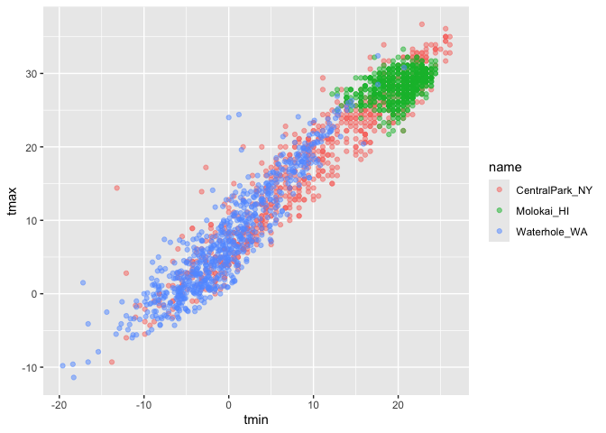

viz i
================

``` r
library(tidyverse)
```

    ## ── Attaching core tidyverse packages ──────────────────────── tidyverse 2.0.0 ──
    ## ✔ dplyr     1.1.4     ✔ readr     2.1.5
    ## ✔ forcats   1.0.0     ✔ stringr   1.5.1
    ## ✔ ggplot2   3.5.1     ✔ tibble    3.2.1
    ## ✔ lubridate 1.9.3     ✔ tidyr     1.3.1
    ## ✔ purrr     1.0.2     
    ## ── Conflicts ────────────────────────────────────────── tidyverse_conflicts() ──
    ## ✖ dplyr::filter() masks stats::filter()
    ## ✖ dplyr::lag()    masks stats::lag()
    ## ℹ Use the conflicted package (<http://conflicted.r-lib.org/>) to force all conflicts to become errors

``` r
library(patchwork)
```

``` r
weather_df=read_csv("./weather_df.csv", na=c("NA","","."))
```

    ## Rows: 2190 Columns: 6
    ## ── Column specification ────────────────────────────────────────────────────────
    ## Delimiter: ","
    ## chr  (2): name, id
    ## dbl  (3): prcp, tmax, tmin
    ## date (1): date
    ## 
    ## ℹ Use `spec()` to retrieve the full column specification for this data.
    ## ℹ Specify the column types or set `show_col_types = FALSE` to quiet this message.

``` r
weather_df
```

    ## # A tibble: 2,190 × 6
    ##    name           id          date        prcp  tmax  tmin
    ##    <chr>          <chr>       <date>     <dbl> <dbl> <dbl>
    ##  1 CentralPark_NY USW00094728 2021-01-01   157   4.4   0.6
    ##  2 CentralPark_NY USW00094728 2021-01-02    13  10.6   2.2
    ##  3 CentralPark_NY USW00094728 2021-01-03    56   3.3   1.1
    ##  4 CentralPark_NY USW00094728 2021-01-04     5   6.1   1.7
    ##  5 CentralPark_NY USW00094728 2021-01-05     0   5.6   2.2
    ##  6 CentralPark_NY USW00094728 2021-01-06     0   5     1.1
    ##  7 CentralPark_NY USW00094728 2021-01-07     0   5    -1  
    ##  8 CentralPark_NY USW00094728 2021-01-08     0   2.8  -2.7
    ##  9 CentralPark_NY USW00094728 2021-01-09     0   2.8  -4.3
    ## 10 CentralPark_NY USW00094728 2021-01-10     0   5    -1.6
    ## # ℹ 2,180 more rows

\##remember this plot?

``` r
weather_df %>% 
  ggplot(aes(x= tmin, y =tmax, color=name)) +
  geom_point(alpha=0.5)
```

    ## Warning: Removed 17 rows containing missing values or values outside the scale range
    ## (`geom_point()`).

<!-- -->

## labels

``` r
weather_df %>% 
  ggplot(aes(x= tmin, y =tmax, color=name)) +
  geom_point(alpha=0.5)+
  labs(
    ttle="temperature plot",
    x="minimum daily temp",
    y="maximum daily temp",
    caption="data from rnoaa pakage; temparature in 2017."
  )
```

    ## Warning: Removed 17 rows containing missing values or values outside the scale range
    ## (`geom_point()`).

<!-- -->

## scales

start with the same plot

``` r
weather_df %>% 
  ggplot(aes(x= tmin, y =tmax, color=name)) +
  geom_point(alpha=0.5)+
  labs(
    ttle="temperature plot",
    x="minimum daily temp",
    y="maximum daily temp",
    caption="data from rnoaa pakage; temparature in 2017."
  )+
  scale_x_continuous(
    breaks=c(-15,0,15),
    labels=c("-15 c", "0","15")
  ) +
  scale_y_continuous(
    trans="sqrt", #squreroot transformation
    position= "right"
  )
```

    ## Warning in transformation$transform(x): NaNs produced

    ## Warning in scale_y_continuous(trans = "sqrt", position = "right"): sqrt
    ## transformation introduced infinite values.

    ## Warning: Removed 142 rows containing missing values or values outside the scale range
    ## (`geom_point()`).

<!-- -->

``` r
weather_df %>% 
  ggplot(aes(x= tmin, y =tmax, color=name)) +
  geom_point(alpha=0.5)+
  labs(
    ttle="temperature plot",
    x="minimum daily temp",
    y="maximum daily temp",
    caption="data from rnoaa pakage; temparature in 2017."
  )+
  scale_x_continuous(
    breaks=c(-15,0,15),
    labels=c("-15 c", "0","15")
  ) +
  scale_y_continuous(
    trans="log" #log transformation
  )
```

    ## Warning in transformation$transform(x): NaNs produced

    ## Warning in scale_y_continuous(trans = "log"): log-2.718282 transformation
    ## introduced infinite values.

    ## Warning: Removed 142 rows containing missing values or values outside the scale range
    ## (`geom_point()`).

<!-- -->

``` r
weather_df %>% 
  ggplot(aes(x= tmin, y =tmax, color=name)) +
  geom_point(alpha=0.5)+
  labs(
    ttle="temperature plot",
    x="minimum daily temp",
    y="maximum daily temp",
    caption="data from rnoaa pakage; temparature in 2017."
  ) +
  viridis::scale_color_viridis(
    name = "lacation",
    discrete = TRUE)
```

    ## Warning: Removed 17 rows containing missing values or values outside the scale range
    ## (`geom_point()`).

<!-- -->

## themes

shift the legend

``` r
weather_df %>% 
  ggplot(aes(x= tmin, y =tmax, color=name)) +
  geom_point(alpha=0.5)+
  labs(
    title="temperature plot",
    x="minimum daily temp",
    y="maximum daily temp",
    caption="data from rnoaa pakage; temparature in 2017."
  ) +
  viridis::scale_color_viridis(
    name = "lacation",
    discrete = TRUE) +
  theme(legend.position="bottom")
```

    ## Warning: Removed 17 rows containing missing values or values outside the scale range
    ## (`geom_point()`).

<!-- -->

change the overall theme

``` r
weather_df %>% 
  ggplot(aes(x= tmin, y =tmax, color=name)) +
  geom_point(alpha=0.5)+
  labs(
    title="temperature plot",
    x="minimum daily temp",
    y="maximum daily temp",
    caption="data from rnoaa pakage; temparature in 2017."
  ) +
  viridis::scale_color_viridis(
    name = "lacation",
    discrete = TRUE) +
    theme_bw() ## theme balck and white 
```

    ## Warning: Removed 17 rows containing missing values or values outside the scale range
    ## (`geom_point()`).

<!-- -->

``` r
weather_df %>% 
  ggplot(aes(x= tmin, y =tmax, color=name)) +
  geom_point(alpha=0.5)+
  labs(
    title="temperature plot",
    x="minimum daily temp",
    y="maximum daily temp",
    caption="data from rnoaa pakage; temparature in 2017."
  ) +
  viridis::scale_color_viridis(
    name = "lacation",
    discrete = TRUE) +
    theme_minimal() ## theme balck and white 
```

    ## Warning: Removed 17 rows containing missing values or values outside the scale range
    ## (`geom_point()`).

<!-- -->

``` r
weather_df %>% 
  ggplot(aes(x= tmin, y =tmax, color=name)) +
  geom_point(alpha=0.5)+
  labs(
    title="temperature plot",
    x="minimum daily temp",
    y="maximum daily temp",
    caption="data from rnoaa pakage; temparature in 2017."
  ) +
  viridis::scale_color_viridis(
    name = "lacation",
    discrete = TRUE) +
    theme_classic() ## theme balck and white but without borders 
```

    ## Warning: Removed 17 rows containing missing values or values outside the scale range
    ## (`geom_point()`).

<!-- -->

``` r
weather_df %>% 
  ggplot(aes(x= tmin, y =tmax, color=name)) +
  geom_point(alpha=0.5)+
  labs(
    title="temperature plot",
    x="minimum daily temp",
    y="maximum daily temp",
    caption="data from rnoaa pakage; temparature in 2017."
  ) +
  viridis::scale_color_viridis(
    name = "lacation",
    discrete = TRUE) +
    ggthemes:: theme_economist() ## theme economist
```

    ## Warning: Removed 17 rows containing missing values or values outside the scale range
    ## (`geom_point()`).

<!-- -->

``` r
weather_df %>% 
  ggplot(aes(x= tmin, y =tmax, color=name)) +
  geom_point(alpha=0.5)+
  labs(
    title="temperature plot",
    x="minimum daily temp",
    y="maximum daily temp",
    caption="data from rnoaa pakage; temparature in 2017."
  ) +
  viridis::scale_color_viridis(
    name = "lacation",
    discrete = TRUE) +
    ggthemes::theme_excel() ## theme excel
```

    ## Warning: Removed 17 rows containing missing values or values outside the scale range
    ## (`geom_point()`).

<!-- -->

## sequence matters for theme_minimal and bottom position

``` r
weather_df %>% 
  ggplot(aes(x= tmin, y =tmax, color=name)) +
  geom_point(alpha=0.5)+
  labs(
    title="temperature plot",
    x="minimum daily temp",
    y="maximum daily temp",
    caption="data from rnoaa pakage; temparature in 2017."
  ) +
  viridis::scale_color_viridis(
    name = "lacation",
    discrete = TRUE) +
    theme_minimal() +
  theme(legend.position="bottom")
```

    ## Warning: Removed 17 rows containing missing values or values outside the scale range
    ## (`geom_point()`).

<!-- -->

## setting options

``` r
library(tidyverse)

knitr::opts_chunk$set(
  fig.width = 6,
  fig.asp= .6, #heigh/weigh
  out.width ="90%"
)

theme_set(theme_minimal() + theme(legend.position = "bottom"))

options(
  ggplot2.continous.color ="viridis",
  ggplot2.continous.fill ="viridis"
)

scale_color_discrete =scale_color_viridis_d
scale_fill_discrete =scale_fill_viridis_d
```
